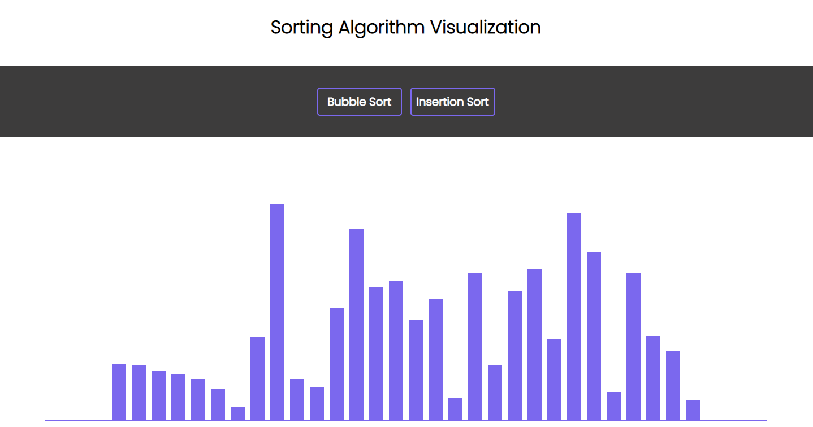

# Sorting Algorithm Visualization
A react app made to help understand sorting algorithms via a visualization.

## Features
This app features a bar chart display with currently 1 sorting algorithm working. On the click of a button the visualization will start.

## Future plans
The future plan is to add speed variability, so users can either speed up or slow down the speed at which the sorting is done.

### Note
This app is best viewed on a desktop computer (for browser, preferably chrome) as a mobile device makes is difficult on the eyes to view the visualization.

### Changelogs
- Version 1.0 (Complete)
     - ~~Currently implemented bubble sort~~
     - ~~Implemented App color scheme~~
- Version 1.1 (Complete)
     - ~~Add speed variability~~
     - ~~Add number of bars present~~
     - ~~Add Insertion Sort visualization~~
- Version 1.2 (Complete)
     - ~~Add QuickSort Algorithm~~
- Version 1.3 (Complete)
     - ~~Add MergeSort Algorithm~~
- Version 1.4 (Complete)
     - ~~Add HeapSort Algorithm~~
- Version 1.5 (Currently in Development)
     - Add in-depth extra information for each algorithm (modal or new Page)